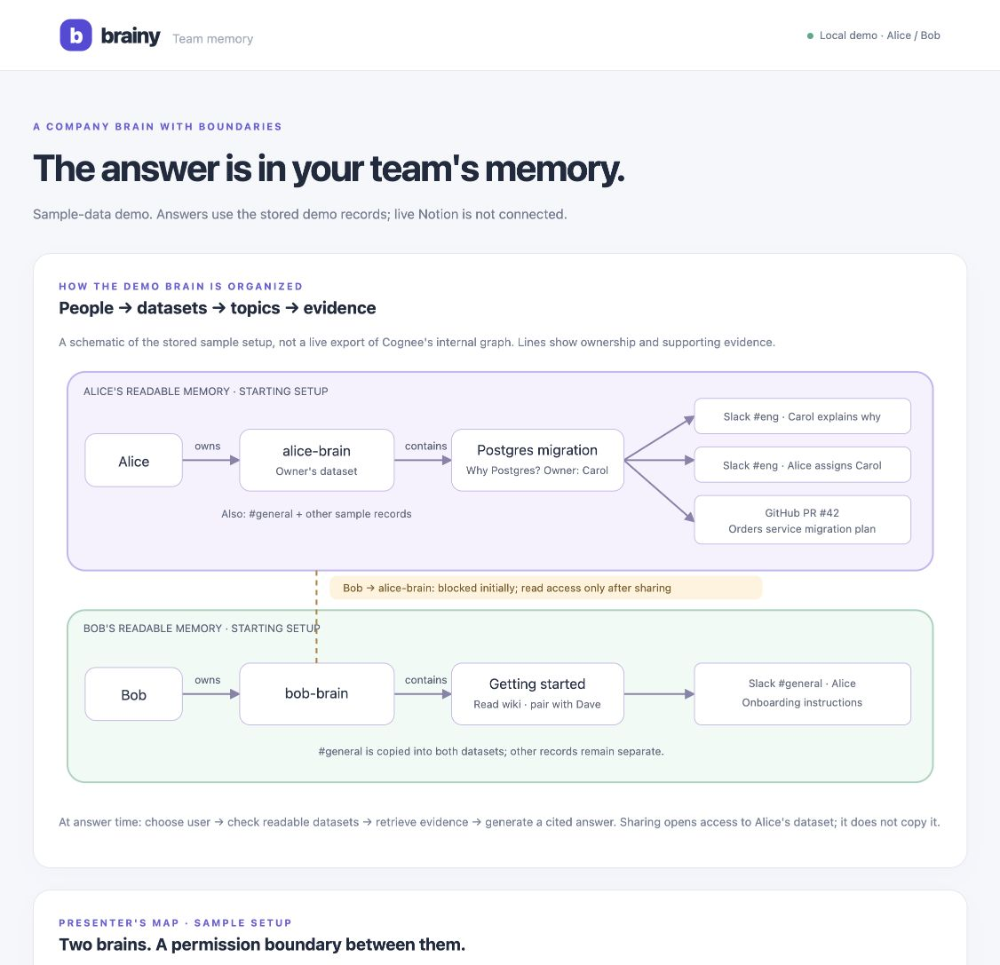
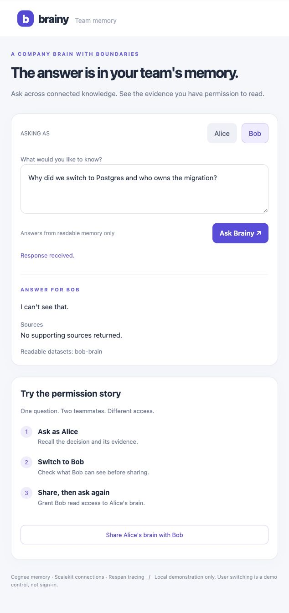
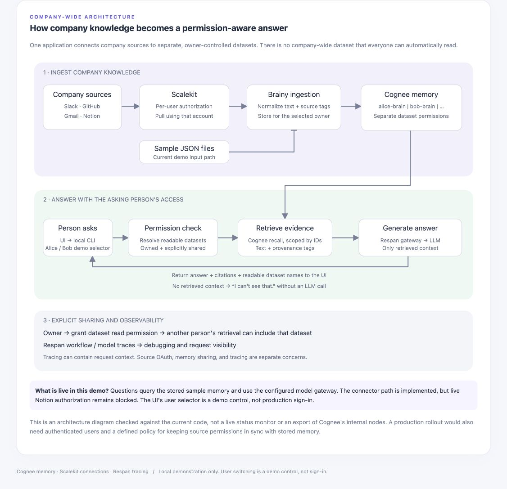

# Brainy

A Company Brain for engineering teams: ask "why did we pick X, who owns it, what is still open?" and get an answer stitched from GitHub and Slack, with citations, showing each person only what they are allowed to see.

Built at "Build a Company Brain" (cognee + Scalekit + Respan), SF Tech Week, 2026-10-07.

```text
Scalekit (per-user pulls: Slack, GitHub)  ->  cognee (per-user datasets, node_set provenance)
        ->  agent (recall + cited answer via Respan gateway)  ->  Slack post as the user
        ->  eval (12 scenarios, independent scorer, before/after)
```

## Judge's guide: see the demo here

**Brainy answers company questions from evidence the asking person can read.** The prototype uses personal datasets and explicit sharing. It does not implement a company/team/project hierarchy or production sign-in.

The demo company, Northwind Labs, and its records are fictional. The browser UI queries real stored Cognee memory and uses the configured model gateway; its answers are not hardcoded. The diagrams describe the sample setup, not a live database export.

**Start here:** [three-minute walkthrough](#three-minute-browser-walkthrough) · [run the UI](#run-the-browser-demo) · [company data flow](#company-wide-data-flow) · [verified-and-unverified](#what-we-verified-and-what-remains)

### What the demo proves

| Person | Starting memory | Migration question |
|---|---|---|
| Alice | Engineering and general Slack records, GitHub records, plus Gmail/Notion samples when ingested | Can explain the Postgres decision and cite evidence |
| Bob | Slack `#general` onboarding and announcements | Cannot see the migration evidence |
| Bob after Alice shares | His own dataset plus read access to `alice-brain` | Can retrieve Alice's migration evidence |



### Three-minute browser walkthrough

1. **Explain the map.** Alice and Bob own separate datasets. A copy of `#general` exists in each. That overlap does not grant Bob access to engineering records.
2. **Click “1 · Alice: migration decision”, then “Ask Brainy”.** The preset asks: “Why did we switch to Postgres and who owns the migration?” Expect the reasons and Carol's ownership, supported by citations.
3. **Click “2 · Bob: same question”, then “Ask Brainy”.** In the unshared starting setup, expect exactly **“I can't see that.”** The response lists `bob-brain` as the readable dataset.
4. **Click “3 · Bob: onboarding”, then “Ask Brainy”.** Bob can answer a question within his boundary: read the onboarding wiki and pair with Dave. The refusal is about missing access, not an empty or broken assistant.
5. **Share deliberately.** Click “Share Alice's brain with Bob” and confirm. This changes persisted permissions on Alice's **entire dataset**, not only the Postgres topic. Select step 2 and ask again. Bob should now answer using the shared evidence.
6. **Explain the pipeline.** Scroll to the company-wide architecture diagram at the bottom. Source authorization, memory permissions, and model tracing have distinct roles.

The “Preview after sharing” toggle is only an illustration. It does not perform step 5 or inspect live permissions. Actual readable dataset names appear beneath each answer. Allow time for model and retrieval calls; the UI disables requests while one is running.

### Why Alice knows about Postgres

The evidence is in the sample records, not in the model's general knowledge:

| Fact | Supporting record |
|---|---|
| JSONB is needed for order metadata; row-level locking is needed for inventory holds; MySQL replication lag caused problems | Carol in Slack `#eng`, timestamp `1790100000.000001` |
| Carol owns the migration | Alice in Slack `#eng`, timestamp `1790100300.000002` |
| The orders service moves from MySQL to PostgreSQL 16 | GitHub `northwind-labs/platform` PR #42 |
| Bob should read the onboarding wiki and pair with Dave | Alice in Slack `#general`, timestamp `1790007000.000003` |

Inspect the fictional source files: [Slack](sample_data/slack.json), [GitHub](sample_data/github.json), [Gmail](sample_data/gmail.json), and [Notion](sample_data/notion.json). Fictional GitHub references illustrate provenance; they are not promised live repository links.

Example verified Alice response, shortened for this guide:

> We switched to Postgres because we need JSONB for order metadata, row-level locking for inventory holds, and MySQL replication lag was causing problems [slack #eng | carol | 1790100000.000001]. Carol owns the migration [slack #eng | alice | 1790100300.000002].

Wording can vary between model calls. Check the facts, evidence, and access boundary rather than exact prose. The source badges summarize retrieved provenance; inline citations identify the evidence used in the answer.



### Run the browser demo

Complete the environment setup below first. Sample records avoid the need for live Slack, GitHub, Gmail, or Notion accounts, but ingestion and answering still require the configured model/embedding services and credentials. Never commit your `.env`.

From the repository root, ingest a fresh sample setup:

```bash
.venv/bin/python -m brain.cli ingest --user alice --github sample_data/github.json --slack sample_data/slack.json --channels eng,general
.venv/bin/python -m brain.cli ingest --user bob --slack sample_data/slack.json --channels general
.venv/bin/python -m brain.demo_ui --port 8765
```

Open **http://127.0.0.1:8765/** on the same computer. The server binds to localhost. Alice/Bob switching is a presentation control, not authentication; do not expose this server as a multi-user public service.

If a previous demo granted Bob access, ingestion alone does not remove that grant. Stop active requests and run `bash scripts/reset_demo.sh` before repeating the permission story. The reset script backs up local state and restores a golden sample state when available, or rebuilds it when needed. Wait for **`Reset OK`** before asking questions. First-time rebuilding can take several minutes. Avoid resetting while another process uses the same memory database.

To run the UI from a separate worktree while using an existing checkout's stored memory, launch its absolute `brain/demo_ui.py` path with the existing checkout's `.venv/bin/python`, from that checkout's root. The UI runs the backend CLI using its launch directory.

### Company-wide data flow



1. **Collect.** Scalekit provides per-user connector authorization and tool execution. For the recorded demo, sample JSON files enter the ingestion path directly.
2. **Normalize.** Brainy converts records into text with source labels and provenance tags.
3. **Remember.** Cognee stores records in the selected owner's dataset, such as `alice-brain` or `bob-brain`.
4. **Authorize and retrieve.** For each question, Brainy resolves the user's readable datasets and passes their IDs to Cognee recall. Shared datasets can be included after an explicit grant.
5. **Answer.** Retrieved context goes through the Respan gateway to the configured model. The prompt asks for cited facts and refusal when evidence is insufficient. No retrieved context returns the refusal without a model call.
6. **Observe.** Respan workflow and model traces help inspect requests. Tracing may include request context and is separate from connector and memory permissions.

Sharing memory does not invite someone to the original Notion workspace or Slack channel. Source permissions are not continuously synchronized by this prototype. Company/team/project inheritance, authenticated UI users, and automatic permission reconciliation are future work.

### What we verified and what remains

| Area | Evidence / limit |
|---|---|
| Browser + stored memory | Alice returned a cited Postgres answer; Bob refused the same question; Bob answered onboarding with a `#general` citation |
| UI controls | Question presets, topic evidence, and before/after visualization were checked in a real browser |
| Backend sharing | Planner recorded a successful before/share/after run in `STATUS.md`; the browser's actual share action has not been exercised in this UI review |
| UI/server tests | 21 tests passed in the UI worktree before the later diagram-only additions; HTTP tests use a fake backend |
| Respan | A live synthetic-context smoke test returned an answer and an HTTP 200 trace upload; dashboard visibility was not independently confirmed here |
| Live connectors | Implemented, but a complete live source-to-answer demo is not verified; the latest Notion authorization attempt returned “connection not found” |
| Evaluation | Existing measured results are documented below; the harder-set change reduced the score and was reverted |
| Hosting | Local browser demo only; no hosted public demo is claimed |

## Quick start (environment setup)

```bash
git clone https://github.com/minhducvo04/brainy.git && cd brainy
uv venv --python 3.12 && uv pip install -r requirements.txt
cp .env.example .env          # fill in RESPAN_API_KEY (+ LLM/EMBEDDING keys) and the three SCALEKIT_* values
```

On a Mac with Apple Silicon, also run the Ladybug fix below.

Run on the recorded sample data (no Slack or GitHub account needed):

```bash
.venv/bin/python -m brain.cli ingest --user alice --github sample_data/github.json --slack sample_data/slack.json --channels eng,general
.venv/bin/python -m brain.cli ingest --user bob --slack sample_data/slack.json --channels general
.venv/bin/python -m brain.cli ask --user alice "Why did we switch to Postgres and who owns the migration?"
.venv/bin/python -m brain.cli ask --user bob   "Why did we switch to Postgres and who owns the migration?"   # I can't see that.
.venv/bin/python -m brain.cli share --owner alice --to bob
.venv/bin/python -m brain.cli ask --user bob   "Why did we switch to Postgres and who owns the migration?"   # now answered
```

Evaluate:

```bash
.venv/bin/python -m brain.cli eval --scenarios scenarios/scenarios.json --out runs/baseline.json
.venv/bin/python -m eval.score --answers runs/baseline.json
.venv/bin/python -m eval.score --compare runs/baseline.json runs/improved.json
```

Live data instead of samples (needs Scalekit connections named `slack` and `github`):

```bash
.venv/bin/python -m brain.cli pull --user alice@acme.com --slack-channels eng,general --github-repo owner/name --save
.venv/bin/python -m brain.cli post --user alice@acme.com --to "#eng" --text "brief" --dry-run
```

## Terminal walkthrough and optional checks

Run from the repo root after setting up the keys in Quick start.

1. **Reset.** Run `bash scripts/reset_demo.sh`. It backs up the old brains to `runs/`
   and restores a golden sample state or rebuilds alice (GitHub, Slack, Gmail, Notion samples) and bob (Slack #general).
   The demo CLI has no revoke command, so reset before repeating the unshared story.
2. **Ask as alice.** Look for a cited answer with the migration reason and owner.
3. **Ask as bob, share, ask again.** Before sharing, expect exactly
   "I can't see that." After sharing, expect an answer citing the shared sources.

```bash
.venv/bin/python -m brain.cli ask --user alice "Why did we switch to Postgres and who owns the migration?"
.venv/bin/python -m brain.cli ask --user bob "Why did we switch to Postgres and who owns the migration?"
.venv/bin/python -m brain.cli share --owner alice --to bob
.venv/bin/python -m brain.cli ask --user bob "Why did we switch to Postgres and who owns the migration?"
```

4. **Optional Gmail + Notion.** Once those packages and their fictional samples
   are loaded for alice, ask the search question. Look for citations to the email
   and page, including the reason and open work.

```bash
.venv/bin/python -m brain.cli ask --user alice "Why did we pick Typesense for search and what is still open?"
```

5. **Preview a Slack post as alice through Scalekit.** Replace the text below with
   the cited answer. This dry run shows the intended post without sending it.

```bash
.venv/bin/python -m brain.cli post --user alice --to "#eng" --text "Paste the cited answer here" --dry-run
```

6. **Show Respan traces and eval before/after.** Open the answer traces in Respan.
   Keep the baseline from before the improvement, run the improved version, then
   compare the same scenarios. Measured on the held-out set 2: before **0.900**,
   after **0.877**, so the change was reverted (see `SUBMISSION.md`).

```bash
.venv/bin/python -m brain.cli eval --scenarios scenarios/scenarios_v2.json --out runs/v2-before.json
.venv/bin/python -m eval.score --answers runs/v2-before.json --scenarios scenarios/scenarios_v2.json
```

## macOS (Apple Silicon): Ladybug fix

On macOS arm64, cognee 1.6.3 uses ladybug 0.19.0 as its graph database. The ladybug wheel does not include its C library, so the first `cognee.remember` fails with `MigrationError: Relational DB Migrations failed`. The log in `~/.cognee/logs` says `Could not find lbug C API shared library`. The library also needs Homebrew OpenSSL 3.

Run this from the repo root after `uv pip install -r requirements.txt`:

```bash
brew install openssl@3
LIB=.venv/lib/python3.12/site-packages/.cache/lbug-prebuilt/lib
mkdir -p "$LIB"
curl -sSL https://github.com/LadybugDB/ladybug/releases/download/v0.19.0/liblbug-osx-arm64.tar.gz | tar -xz -C "$LIB"
.venv/bin/python -c "import ladybug._lbug_capi"   # no error = fixed
```

Notes:
- Recreating `.venv` removes the fix. Run it again.
- This project configures repository-local `.cognee_system` and `.cognee_data` directories. Keep the launch directory consistent when ingesting, asking, or resetting.

## Layout

| Path | What |
|---|---|
| `brain/demo_ui.py`, `brain/demo_ui.html` | Local browser demo, guided questions, access map, and architecture diagrams |
| `docs/demo/` | Screenshots of the running demo for this README |
| `brain/pull.py`, `brain/act.py` | Scalekit per-user pulls and the Slack post (as the user, never a bot token) |
| `brain/records.py`, `brain/memory.py` | remember() text format, node_set tags, per-user datasets, share, forget |
| `brain/agent.py` | recall, cited answer through the Respan gateway, refusal when it cannot see |
| `eval/score.py`, `scenarios/` | independent scorer (fact match, sources, leak = 0) and 12 scenarios |
| `sample_data/` | fictional Northwind Labs pulls so judges can run without our accounts |

Team workflow: [CONTRIBUTING.md](CONTRIBUTING.md). New teammate or agent: [docs/TEAMMATE-SETUP.md](docs/TEAMMATE-SETUP.md). Live status: [STATUS.md](STATUS.md). Event rules: [docs/event.md](docs/event.md).
